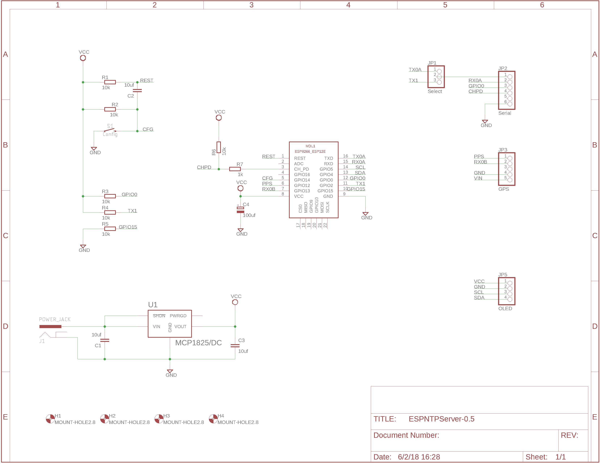

# ESPNTPServer
GPS fueled ESP8266 based NTP Server

[ESPNTPServer](ESPNTPServer) Contains the code for the NTP Server. I used [Eclipse with an Arduino plugin](http://sloeber.io) for development.  If you want to use the Arduino IDE then create an empty file named ESPNTPServer.ino

[hardware](hardware) contains the esp8266 arduino core version used as a git submodule

[libraries](libraries) has all needed libraries as git submodules 

[eagle](eagle) contains the schematic and board designs in Eagle cad.

[enclosure](enclosure) contains the STL files for the enclosure.

This is designed around [this GPS module](https://www.amazon.com/gp/product/B075DD5746/) but any module with standard NMEA output and a pult per second signal will work if you redesign the board or use an adapter.

I also used [this display module](https://www.amazon.com/gp/product/B00O2KDQBE/).  You can use others but be careful with the power polarity, I have modules where VCC and ground pins are in a different order.

